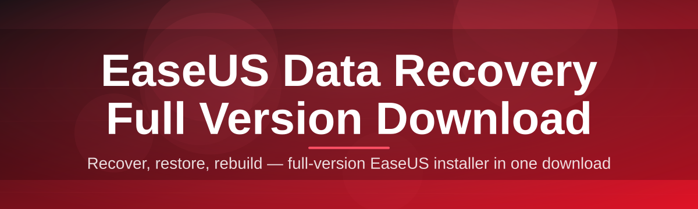

# data-recovery-suite-manager 🗂️💾

  

*Your files went missing — this is the friendly map that helps you find them again.*

## 🌱 Overview

Losing files never happens at a convenient time. A drive suddenly clicks, a partition disappears, or someone empties the recycle bin one click too fast — and suddenly years of photos, documents, or project data feel gone. **data-recovery-suite-manager** exists as a companion project around the EaseUS Data Recovery experience: a landing page and management layer that helps you understand, configure, and launch the full version of the tool without getting lost in scattered mirrors or outdated instructions.

This repository isn't the recovery engine itself — it's the organized front door. Think of it like a well-lit lobby in front of a very technical building: instead of wandering the internet trying to figure out which EaseUS Data Recovery build is current, which edition matches your Windows version, or whether a download link is trustworthy, you land in one place that keeps everything current for 2026 and points you straight to the official download experience.

Who is this for? Home users who just want their vacation photos back, IT-adjacent folks helping a relative recover a corrupted USB drive, small businesses trying to restore a formatted backup disk, and anyone who values a **clear, no-nonsense path** from "I lost a file" to "I have it again." No jargon walls, no dozen confusing buttons — just a guided route to the EaseUS Data Recovery full version download and a bit of architecture explaining how the whole recovery journey actually flows.

  

---

## 🔍 What Makes This Different

> [!NOTE]
> None of the capabilities below are gimmicks — each one maps to a real pain point people run into when trying to recover lost data on Windows.

- **Signal-clean landing page** — one destination, one clear call-to-action, no pop-up maze standing between you and the EaseUS Data Recovery full version download.

- **Version-aware guidance** — the page tracks the 2026 build lineage so you're not stuck reading advice written for a three-year-old release.

- **Format-agnostic recovery mapping** — whether it's an NTFS partition, a formatted SD card, or a corrupted external HDD, the guidance adapts instead of giving you a one-size-fits-all script.

- **Zero dependency friction** — the tool this page introduces runs standalone on Windows, so you're not chasing missing runtimes or fighting package managers.

- **Session-safe workflow language** — every step is written to minimize the chance of overwriting recoverable sectors, because in data recovery, patience is architecture too.

- **Plain-English troubleshooting** — real questions people actually type into search bars, answered without recycled corporate copy.

- **Lightweight footprint philosophy** — the emphasis throughout is on doing the essential work well rather than bundling in features nobody asked for.

- **Accessibility-first layout** — large touch targets, readable contrast, and a download flow that works the same whether you're on a laptop trackpad or a desktop mouse.

---

## 🚀 How to Get Started

1. **Visit the landing page** using the download button above — it's the single official entry point for this project.

2. **Download the EaseUS Data Recovery full version** package from the page; it's built for Windows 10 and 11 out of the box.

3. **Run the installer** and let it set up — no extra configuration files, no terminal commands required.

4. **Launch, select your target drive or folder**, and start the scan. That's genuinely it — three clicks stand between "lost" and "found."

> [!TIP]
> Before you install anything, stop using the affected drive as much as possible. Every new file written increases the odds that recoverable data gets overwritten.

---

## 🖥️ System Requirements

| Requirement | Details |
|---|---|
| **OS** | Windows 10 or Windows 11 (64-bit recommended) |
| **Dependencies** | None — fully standalone, no runtime installs needed |
| **Disk space** | Free space equal to at least the size of files you plan to recover (recover to a *different* drive) |
| **RAM** | 4 GB minimum, 8 GB+ for large-volume scans |
| **Permissions** | Administrator rights recommended for deep/raw scans |

  

---

## ⚙️ How It Works

The recovery journey, boiled down to its architecture, follows a predictable rhythm — and understanding that rhythm is what actually helps you recover more, not less.

1. **Selection** — you point the tool at a drive, partition, or specific folder rather than scanning your entire system blindly.

2. **Scanning** — a quick scan reads the file table for anything still indexed, while a deep scan reconstructs file signatures sector-by-sector for anything the file system has forgotten about.

3. **Indexing** — recoverable items get categorized by type (photos, documents, video, archives) so you're not scrolling through a flat, chaotic list.

4. **Preview & selection** — you preview files before committing to recovery, which avoids wasting time restoring things you don't actually need.

5. **Restoration** — selected files are written out to a *different* drive than the source, preserving the integrity of what's left to recover.

> [!IMPORTANT]
> Always restore recovered files to a separate drive from the one you're scanning. Writing recovered data back onto the source drive can silently destroy the very files you're trying to save.

---

## 🧩 Troubleshooting

<strong>The scan seems stuck at a certain percentage — is it frozen?</strong>

Deep scans on large or heavily fragmented drives can pause visually while processing dense sectors. Give it time — a stalled progress bar is more often a busy engine than a broken one. If it truly hasn't moved in 30+ minutes, restart the scan in quick-scan mode first.

<strong>Why can't I find my file even after a deep scan?</strong>

Files overwritten by new data, securely wiped, or affected by physical drive damage may be unrecoverable by any software. This is why minimizing drive usage after data loss matters so much.

<strong>Can I recover files from a formatted drive?</strong>

Yes — formatting typically clears the file table, not the underlying data, so a deep scan can often reconstruct files even after a format, especially if nothing was written afterward.

<strong>Is the recovered file quality guaranteed?</strong>

Not always. Fragmented or partially overwritten files may recover with corruption. Preview before restoring so you know what you're actually getting.

<strong>Does this work on external drives and USB sticks?</strong>

Yes — as long as Windows can detect the device, both quick and deep scans apply to external storage the same way they apply to internal drives.

<strong>My antivirus flagged the download — is that normal?</strong>

Deep-scanning tools that read raw disk sectors sometimes trigger heuristic warnings from overly cautious antivirus software. Always download only from the official landing page linked in this README.

---

## 🎨 UI / UX Details

- **Keyboard shortcuts** — `Ctrl+F` to filter results by name, `Ctrl+A` to select all previewed files, `Space` to quick-preview a highlighted item.

- **Theme support** — light and dark interface modes, auto-matching your Windows theme setting by default.

- **Settings persistence** — your last scanned location and filter preferences are remembered between sessions so you're not re-configuring every time.

- **Progress transparency** — a running counter of files found by category (images, documents, video, other) updates live during scanning, not just at the end.

> [!TIP]
> Filter by file type *before* the scan finishes if you're only after, say, photos — it narrows the preview list immediately without waiting for the full pass.

---

## 🤝 Contributing & Community

This project welcomes documentation improvements, translation help, and landing-page polish from the community. If you've found a clearer way to explain a recovery scenario, or spotted an outdated instruction, open an issue or a pull request.

- Star ⭐ the repo if this page helped you find your way to a working recovery flow.

- Open a discussion thread if you have a data-loss scenario that isn't covered in the troubleshooting section above.

- Pull requests improving clarity, accessibility, or accuracy are always reviewed with gratitude.

> [!WARNING]
> This repository does not host or redistribute installer binaries directly. Always use the official landing page link for the EaseUS Data Recovery full version download to ensure you're getting a legitimate, up-to-date build.

---

## 📄 License

Released under the [MIT License](LICENSE), 2026.

---

## ⚠️ Disclaimer

This repository is an independent landing-page and documentation project. It is not officially affiliated with, endorsed by, or sponsored by EaseUS. All trademarks belong to their respective owners. Data recovery outcomes vary by drive condition, damage type, and how much time has passed since data loss — no tool can guarantee 100% recovery in every scenario. Use recovery software responsibly and always maintain regular backups going forward.

  

